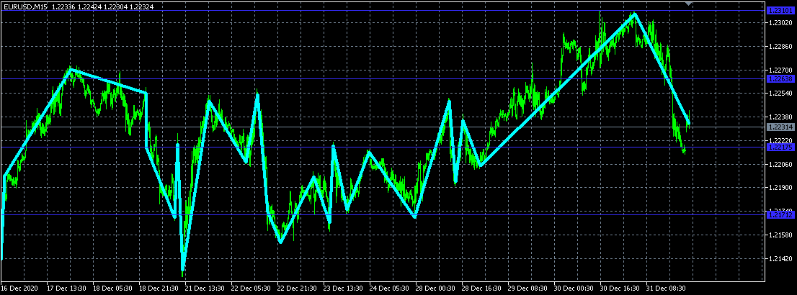
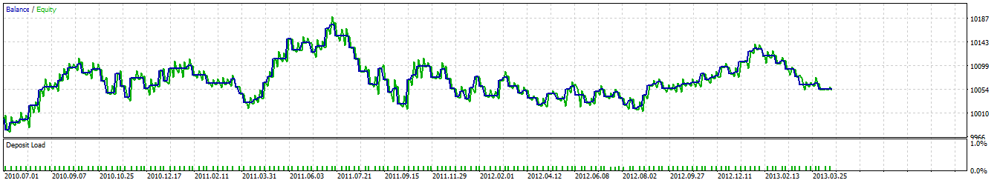

# Teste da técnica Fimathe através de automação

### Descrição
Esse algoritmo para MT5 usa a técnica Fimathe, do Marcelo Ferreira, adaptado para não depender de um humano para determinar o canal de referência. Em vez disso, pega um intervalo de candles, subdivide-o a partir de máximas diferenças, calcula e ordena as distâncias, e usa a distância mediana como canal de referência.
Foi criado no intuito exclusivo de testar o método. Não está pronto para negociações sérias, embora mostre pontencial por, mesmo não usando martigale, se manter acima do prejuízo total que se obteria com lances aleatórios com pagamento de spread.

### Melhorias propostas
Talvez possa-se melhorar testando e utilizando intervalos específicos do horário, dias da semana, medidor de volatilidade, coincidência com outro tempo gráfico, etc.
